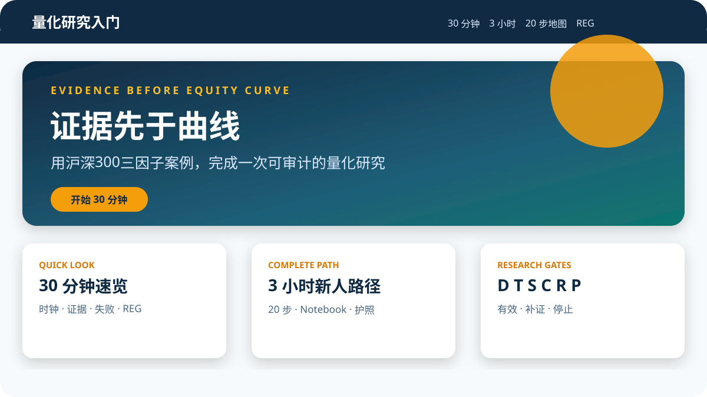

# 量化研究入门：证据先于曲线

> 一套面向量化策略实习生的中文、可执行、可复现学习产品：沿 20 步完成沪深300三因子研究，并用 REG 判断结论是否可信。

[](https://github.com/ph-kleene/quant-research-onboarding/actions/workflows/ci.yml)
[](https://ph-kleene.github.io/quant-research-onboarding/)

**在线学习站：<https://ph-kleene.github.io/quant-research-onboarding/>**



## 从这里开始

| 你有多少时间 | 入口 | 完成后能做什么 |
|---|---|---|
| 30 分钟 | [快速理解](https://ph-kleene.github.io/quant-research-onboarding/content/quickstart.html) | 读懂研究时钟、主证据、失败实验和 REG |
| 3 小时 | [新人完整路径](https://ph-kleene.github.io/quant-research-onboarding/content/three-hours.html) | 跟随 20 步完成研究护照 |
| 深入实践 | [研究者路径](https://ph-kleene.github.io/quant-research-onboarding/content/deep-dive.html) | 运行 Notebook、测试并迁移模板 |

## 最短本地启动

WSL 中只使用这一套入口：

```bash
bash scripts/project.sh setup
bash scripts/project.sh test
bash scripts/project.sh build
bash scripts/project.sh preview
```

浏览器打开终端显示的本地地址。已经构建后，也可直接打开 `_site/content/index.html`；页面资源均在本地，可断网阅读。

完整命令：

| 命令 | 网络/Token | 作用 |
|---|---|---|
| `setup` | 需要网络，不需要 Token | 安装/同步 uv 管理的 Python 3.12 环境并检查 Quarto |
| `probe` | 需要 Token | 最小探测九个 Tushare 端点，生成脱敏能力报告 |
| `fetch` | 需要 Token | 刷新真实案例所需数据；原始缓存只写仓库外 |
| `test` | 均不需要 | 运行静态检查、研究测试与 Notebook E2E |
| `build` | 均不需要 | 用合规教学夹具生成公开证据并构建离线站点 |
| `preview` | 均不需要 | 本地预览站点 |
| `audit` | 均不需要 | 扫描工作区、历史、产物、秘密与许可风险 |
| `all` | Token 可选 | 按安全顺序执行全部；有 Token 时增加真实探测和刷新 |

## 真实数据刷新

正式研究路线使用 Tushare。不要把 Token 粘贴到聊天、Notebook、README 或项目文件中。

二选一：

```bash
export TUSHARE_TOKEN='在本机安全输入，不要提交'
```

或创建仓库外文件：

```text
~/.config/shangchen-quant-research-onboarding/tushare.env
```

文件内容是 `TUSHARE_TOKEN=...`，权限必须为 600。然后运行：

```bash
bash scripts/project.sh probe
bash scripts/project.sh fetch
```

探测先于下载；程序默认不超过 180 次/分钟，支持退避、不可变缓存和续跑。原始响应位于 `~/.cache/shangchen-quant-research-onboarding/`，不会复制进仓库。

## 没有 Token 时

仍可使用完整中文站、确定性教学案例、失败实验、REG、模板、全部单元测试和 Notebook E2E。页面会明确标注“教学夹具”，不会把夹具收益称作真实市场证据；仓库中保留的是最后一次脱敏、不可逆的真实研究摘要。

## 运行 Notebook

推荐先执行统一测试，它会在临时目录执行 Notebook，避免提交运行输出：

```bash
bash scripts/project.sh test
```

源文件位于 `notebooks/research-case.ipynb`。核心计算来自 `src/quant_onboarding/`，Notebook 不是唯一业务逻辑。

## 研究协议

- 市场：A 股、沪深300历史成分。
- 总样本：2018-01-01—2025-12-31。
- 探索期：2018-01-01—2022-12-31。
- 确认期：2023-01-01—2025-12-31。
- 因子：价值、12-1 动量、低波动，经 winsorize、市值中性化、标准化后等权。
- 组合：Top 20% 等权长仓，月末 18:00 形成信号，下一有效交易日开盘执行。
- 约束：涨跌停、停牌、延迟成交、实际换手和成本。
- 基准：必须由 `index_basic` 发现并经 `index_daily` 验证；总收益不可用时使用明确标注的价格指数。
- 结论：盈利不是测试条件。D/T/P 决定研究有效性，S/C/R 决定继续、补证或停止。

## 当前真实案例结论

九个 Tushare 端点的最小探测均成功。实际基准为 `H00300.CSI`（沪深300全收益，含股息），价格/成分代码为 `000300.SH`。2018—2025 共形成 96 个有效月度截面；但全量涨跌停执行数据未满足正式成交门，且历史成分滞后一月敏感性未通过，因此当前结论是 **credible stop**：因子 IC 与组合指标仅作诊断，不作为可成交策略或收益主张。详见[贯穿案例](https://ph-kleene.github.io/quant-research-onboarding/content/case-study.html)。

## 数据和许可

公开仓库只包含源码、原创课程、确定性小型夹具、不可逆汇总、哈希和复现说明。默认不公开 Tushare 原始响应、缓存、可大规模重构的付费数据、Token、Cookie、私钥或 `.env`。真实派生结果是否公开由 `audit` 的许可检查决定。

## 如何验证本项目

```bash
bash scripts/project.sh test
bash scripts/project.sh build
bash scripts/project.sh audit
```

用户八步自测：从 README 进入 → 打开在线站 → 完成 30 分钟路线 → 查看/运行案例 → 找出失败错误 → 用 REG 决策 → 用模板提出新问题 → 判断能否用于新人培训并记录障碍。详细清单见[自测页面](https://ph-kleene.github.io/quant-research-onboarding/content/self-test.html)。

## 目录

```text
content/        中文 Quarto 学习站
notebooks/      可执行教学入口
src/            可测试研究与数据逻辑
tests/          单元、契约、泄漏、回归和治理测试
fixtures/       可公开、确定性教学数据
templates/      可复用研究模板
evidence/       脱敏探测、REG 与构建证据
docs/           冻结需求与设计合同
scripts/        唯一命令入口与验证工具
```

## 免责声明

本项目仅用于研究方法与新人培训，不构成投资建议、收益承诺或实盘交易系统。历史结果（包括真实市场结果）不能保证未来表现。

## 许可证

原创代码与文字采用 [MIT License](LICENSE)。第三方工具和数据受各自许可约束；Tushare 数据不随本仓库再分发。
