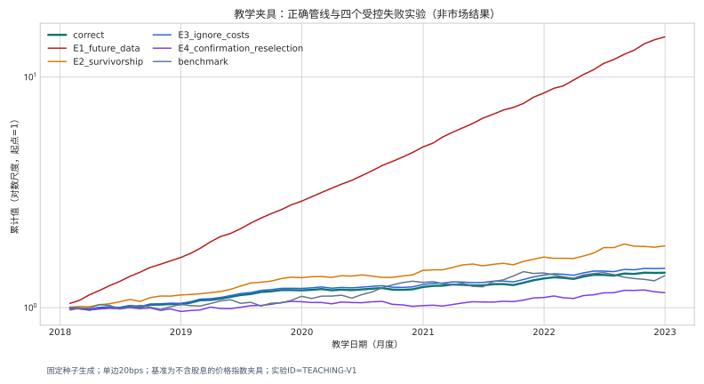

## 学习进度：第 3/5 步 · 回测陷阱

## 本节要回答的问题

为什么看起来很漂亮的回测结果可能是假的？四个最常见的错误如何制造出虚假的高收益？

**预计时间**：15 分钟 · **需要代码**：不需要

---

## 为什么要故意犯错

新人通常能识别代码报错，却难以识别**"代码运行成功、研究结论错误"**的情况。四个实验复用同一套数据和代码，每次只改变一个条件——因此差异可以归因于那个唯一的错误。

::: {.evidence}
**实验设计原则**：每个实验只改变一个布尔开关，其余部分与正确管线完全一致。这样你看到的差异，就是那个唯一错误导致的后果。
:::

---

## 实验对比图

{fig-alt="教学夹具正确管线与四个受控失败实验的累计曲线对照。" width="100%"}

**看图指引**：
- **正确做法**（绿色）是基准
- **E1 未来数据**（红色）和 **E3 忽略成本**（蓝色）明显高于正确做法——但它们是不可信的
- **E2 幸存者偏差**（橙色）和 **E4 确认污染**（紫色）也与正确做法不同

---

## E1：未来数据——收益最高，但完全是假的

::: {.failure}

### 错误做法

用**未来的收益数据**给过去的信号打分。例如：用 1 月 31 日到 2 月 28 日的实际收益，来评价 1 月 31 日形成的信号。

### 为什么这看起来很美

你"预测"的正好是你已经知道的结果。IC 会非常高，回测曲线会非常漂亮。

### 如何识别

检查信号形成时点和标签数据的时间关系。如果标签数据的时间早于或等于信号形成时点，那就是未来函数。

### 在真实研究中

我们规定：`数据可用时点 <= 信号形成时点 < 交易执行时点`。标签严格使用信号日期之后的收益。所有时间点都有自动化测试验证。

:::

---

## E2：幸存者偏差——遗漏了"失败者"

::: {.failure}

### 错误做法

用 2025 年的沪深 300 成分股名单，回测 2018—2025 年的策略。

### 为什么这看起来很美

2025 年仍在指数中的股票，是那些在 2018—2025 年间"活下来"的公司。已退市、被剔除或大幅下跌后不再符合指数条件的股票，都被排除在外——你的回测只看到了"成功者"。

### 如何识别

检查历史股票池的构造方式。每个时间点的成分股，必须是**当时实际生效的名单**，不能是现在的名单。

### 在真实研究中

我们使用 `index_weight` 按月末查询当时的实际成分股，并对成分股发布时间做了滞后一月敏感性检查。

:::

---

## E3：忽略成本——换手会吞噬收益

::: {.failure}

### 错误做法

假设每月调仓没有任何成本——不考虑佣金、滑点、涨跌停限制和停牌。

### 为什么这看起来很美

你的回测可以"免费"完成所有交易。但现实中，每次调仓都有成本：
- 佣金（双边约 20—50 bps）
- 涨跌停时无法交易
- 停牌时无法交易
- 大量换手可能产生市场冲击

### 如何识别

检查回测是否扣除了交易成本，是否考虑了涨跌停和停牌限制。如果换手率很高但成本很低，结果可能被高估。

### 在真实研究中

我们使用保守的次日开盘成交模型：涨停不买、跌停不卖、停牌不成交。成本和换手只在实际成交时确认。未成交订单保留旧持仓，后续交易日优先重试。

:::

---

## E4：确认污染——把试错包装成"样本外验证"

::: {.failure}

### 错误做法

先看确认期（2023—2025）的结果，然后回过头调整因子参数或权重，再宣称"样本外验证成功"。

### 为什么这看起来很美

确认期的结果看起来很好——但那是因为你针对确认期做了优化。这就像先看了答案再做题，然后说"我都会"。

### 如何识别

检查确认期是否在**参数冻结之后**才被查看。如果参数在确认期之后被修改过，确认期就不再是"样本外"——它已经变成了探索的一部分。

### 在真实研究中

我们使用冻结键（freeze key）和确认治理计数器：
- 首次确认揭示只允许一次
- 相同输入的确定性复现不算新的研究决策
- 揭示后修改参数 → 标记"污染"（contaminated），降级为探索性
- 删除日志不能恢复未污染状态

:::

---

## 四个实验的 REG 对比

| 实验 | 唯一改变 | 被破坏的可信度 | 预期 REG 判断 |
|---|---|---|---|
| 正确做法 | 无 | 无 | 由证据决定 |
| E1 未来数据 | 使用未来信息 | 第二问（时序） | 研究无效 |
| E2 幸存者偏差 | 用当前成分回填历史 | 第一问（数据） | 研究无效 |
| E3 忽略成本 | 成本强制为 0 | 第五问（成本） | 研究有效，策略需补证 |
| E4 确认污染 | 揭示后重新选参 | 第三问（复现） | 确认结果降级 |

---

## 练习：判门

给每个情形判断最可能被破坏的可信度问题：

1. **IC 很高，但标签没有后移。** 

点击展开答案

**第二问（时序）**：标签没有后移意味着用同期收益评价信号，属于未来函数。研究无效。

2. **研究完全可复现，但成本后净效应为负。** 

点击展开答案

**第五问（成本）**：研究有效（前三问通过），但策略应停止推进——成本后没有超额收益。

3. **总收益指数无权限，已明确降级为价格指数且不以超额为唯一硬门。** 

点击展开答案

**第一问（数据）**：有降级方案且已明确标注，研究可继续。但基准限制已标黄。

4. **确认期后把 Top 20% 改成 Top 10% 再宣称样本外成功。** 

点击展开答案

**第三问（复现）**：确认污染。参数在查看确认期后修改，确认结果降级为探索性。

---

## 下一步

[下一步：可信度六问 →](credibility.qmd)

[← 返回：跟做研究](case-study.qmd)
