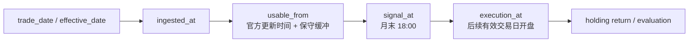

# 03｜学习体验与内容设计

## 1. 课程主线

学习者不是照抄一个“赚钱策略”，而是完成一次可审计研究：定义问题、确认数据能力、冻结协议、构建因子、模拟可成交组合、检查失败、查看确认期并做 REG 决策。所有路线共享同一代码、图表、模板和研究护照。

## 2. 三条学习路线

| 路线 | 目标时长 | 必做内容 | 产出 |
|---|---:|---|---|
| 快速理解 | 30 分钟 | 1、2、4、8、12、16、18、20 | 能读懂研究时钟、主结果、一个失败案例与 REG 结论 |
| 完整实践 | 3 小时 | 全部 20 步，运行已缓存 Notebook | 一份完成的研究护照与自测记录 |
| 深入研究 | 开放 | 全部步骤、测试、敏感性、模板迁移 | 新问题登记与可复现实验 |

## 3. 20 步内容地图

| 步骤 | 页面主题 | 核心问题 | 可验证产物 |
|---:|---|---|---|
| 1 | 从研究问题开始 | 可证伪假设是什么？ | 问题卡 |
| 2 | 先画研究时钟 | 数据何时真正可用？ | 时钟图 |
| 3 | 数据能力探测 | 权限和历史覆盖足够吗？ | 探测报告 |
| 4 | 冻结实验协议 | 哪些选择必须先登记？ | 协议快照 |
| 5 | 定义样本与分期 | 探索期和确认期如何隔离？ | 分期表 |
| 6 | 构造历史股票池 | 当时的沪深 300 成分是谁？ | 月度成员表 |
| 7 | 检查原始数据 | 缺失、停牌、异常意味着什么？ | 数据质量表 |
| 8 | 正确处理复权收益 | 如何避免未来最终因子归一化？ | 收益单测 |
| 9 | 构造价值因子 | PB 数据何时可用？ | 因子快照 |
| 10 | 构造动量因子 | 如何跳过最近区间并防止泄漏？ | 因子快照 |
| 11 | 构造低波动因子 | 窗口、缺失和年化如何定义？ | 因子快照 |
| 12 | 对齐标签和时点 | 特征、信号、成交如何错位？ | 对齐断言 |
| 13 | 截面处理与合成 | 去极值、标准化和权重如何固定？ | 合成分数 |
| 14 | 构建组合 | 选股数、权重与再平衡规则是什么？ | 目标权重 |
| 15 | 模拟次日开盘成交 | 涨跌停、停牌和延迟订单如何处理？ | 成交日志 |
| 16 | 计入成本与持有收益 | 何时确认换手和费用？ | 收益分解 |
| 17 | 对齐基准与指标 | 总收益/价格指数差异如何披露？ | 评价表 |
| 18 | 运行失败实验 | 错误方法会把结果推向何处？ | 正误对照 |
| 19 | 揭示确认期 | 如何区分复现、决策和污染？ | 确认日志 |
| 20 | REG 与复现交付 | 结论是否有效、下一步是什么？ | REG、护照、复现包 |

## 4. 固定案例协议

- 研究问题：在可获得信息与可成交约束下，价值、动量、低波动的等权复合排序是否能形成相对沪深 300 基准具有稳定证据的组合？
- 总样本：2018-01-01—2025-12-31。
- 探索期：2018-01-01—2022-12-31。
- 确认期：2023-01-01—2025-12-31。
- 股票池：每个再平衡时点可获得的沪深 300 历史成分。
- 频率：月末信号、下一有效交易日开盘执行。
- 信号时点：默认月末交易日 18:00，且所有 P0 数据的 `usable_from` 已到达。
- 组合：复合分数排名前 30，等权；参数在确认期首次查看前冻结。
- 成本：双边费用与冲击参数写入协议；仅在实际成交时计提。
- 评价：绝对表现、对齐基准、回撤、换手、覆盖率、延迟成交和分期稳定性并列展示。

这些是项目教学决策，不宣称是行业普适最优参数。

## 5. 因子与收益口径

价值因子使用当时可用的 PB，方向取低 PB 为高分；动量与低波动使用复权收益序列。原始 OHLC 来自 `daily`，复权因子来自 `adj_factor`，相邻收益固定为：

```text
r_t = (price_t × adj_factor_t) / (price_{t-1} × adj_factor_{t-1}) - 1
```

不得使用未来最终复权因子归一化出的绝对价格。标签必须向后移动；组合在信号后继续持有旧权重，直到订单实际成交。组合日收益固定为前一交易日收盘后持仓权重乘当日证券收益，实际成交产生的成本在成交日扣除。基准评价区间与组合可实现收益区间一致。

## 6. 统一研究时钟



所有参与信号的数据必须满足 `usable_from <= signal_at < execution_at`。Tushare 不原生提供历史 `available_at`，因此不得伪造该字段；`usable_from` 是由官方更新说明和保守规则推导的可审计字段。无法证明历史真实发布时间时，必须在护照中披露，并做滞后一日或一月敏感性检查。

## 7. 保守成交教学模型

订单在每个后续有效交易日优先重试：

1. 没有有效 `daily` 或 `suspend_d` 表明全天停牌：不成交。
2. 买入且开盘价等于涨停价：不成交。
3. 卖出且开盘价等于跌停价：不成交。
4. 卖出位于涨停价或买入位于跌停价，不能仅据此判定不成交。
5. 其余情形若有开盘成交量，则按开盘价全额成交。
6. 未成交时保留原持仓，后续有效日优先重试；成本和换手只在实际成交时确认。

这是基于日频数据的教学近似，不模拟盘口排队、深度或部分成交。报告必须展示延迟订单次数、延迟天数和受影响目标权重。

## 8. 基准叙事

H00300 被视为沪深 300 总收益指数候选，但其在当前 Tushare 权限下的完整 `ts_code` 与历史覆盖尚未证明。实施时先用 `index_basic` 发现实际代码，再对候选做最小 `index_daily` 探测；未成功不得进入主结果。

若总收益指数不可用，使用 Tushare 实际返回并探测成功的沪深 300 价格指数（例如候选 `000300.SH`），页面必须明确标注“价格指数”和不含股息的限制。相对价格指数超额收益不能成为唯一 REG 硬门；未来可通过稳定、合规的总收益数据适配器替换。

## 9. 正确/失败双轨

| 实验 | 故意错误 | 预期诊断 |
|---|---|---|
| E1 未来数据 | 使用尚未到 `usable_from` 的数据或错误标签 | 时间门红灯，结果无效 |
| E2 错误股票池 | 用当前成分回填历史 | 幸存者偏差，覆盖和收益变化 |
| E3 忽略成本/成交限制 | 目标权重当日无摩擦成交 | 换手与收益被高估 |
| E4 确认期污染 | 查看结果后改参数再重跑 | 标记 contaminated，降级为探索性 |

失败实验要共用主管线，仅切换一个受控错误开关，避免演示代码与正式逻辑漂移。

## 10. 确认期治理

首次查看确认期前冻结假设、因子、参数、数据规则、评价指标和 REG 门槛，并形成不可逆日志。确认期允许一次“会影响研究决策的揭示”；相同代码、数据、配置的确定性复现不算新的研究试验，工程修复重跑必须记录。查看结果后修改参数，原确认期即被污染并降级为探索性；删除日志不能恢复未污染状态。

研究护照至少记录：

- `confirmation_reveal_count`
- `research_decision_count`
- `reproduction_run_count`
- `contaminated`
- `contamination_reason`

## 11. REG：研究评审门

| 维度 | 核心问题 | 红灯后果 |
|---|---|---|
| D 数据 | 权限、覆盖、股票池、复权是否可信？ | 研究结论无效 |
| T 时点 | 可用时点、信号、标签、成交是否正确？ | 研究结论无效 |
| P 复现 | 环境、数据、代码、配置和产物能否确定性复现？ | 研究结论无效 |
| S 统计 | 样本量、分期与统计证据是否足够？ | 补充研究或停止 |
| C 成本/成交 | 成本和受限成交后是否仍有意义？ | 补充研究或停止 |
| R 稳健性 | 参数、截面和保守滞后下是否稳健？ | 补充研究或停止 |

门槛分三类标记：方法必需（如无未来数据）、项目教学决策（如覆盖率阈值）、未来团队可配置（如成本假设）。不得把教学阈值包装成普适行业标准，也不得把盈利设成合格研究的前提。

## 12. 用户本人八步验收

1. 从 GitHub 首页开始，不使用口头说明。
2. 进入 30 分钟路线并找到最终站点 URL。
3. 按统一命令运行或查看案例。
4. 识别一个失败实验及其错误机制。
5. 解释 REG 给出的研究有效性与项目状态。
6. 用模板提出一个新研究问题。
7. 记录障碍、错误信息与解决路径。
8. 判断该产品是否可用于实习生训练，并写出理由。

P0 还必须通过自动化测试、Notebook E2E、离线构建、正确/失败门、链接、视觉和 README 冷启动检查。外部代表性用户与第二机器复现只保留为未来验证指标。
