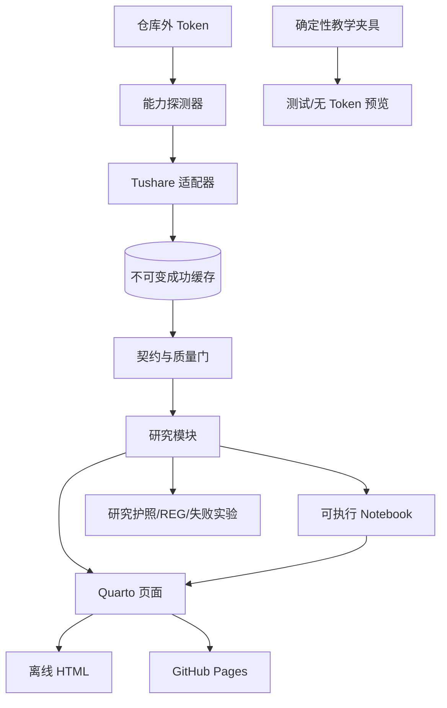
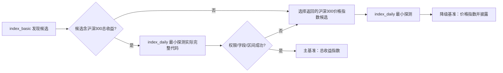
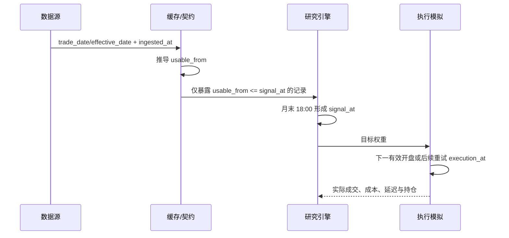
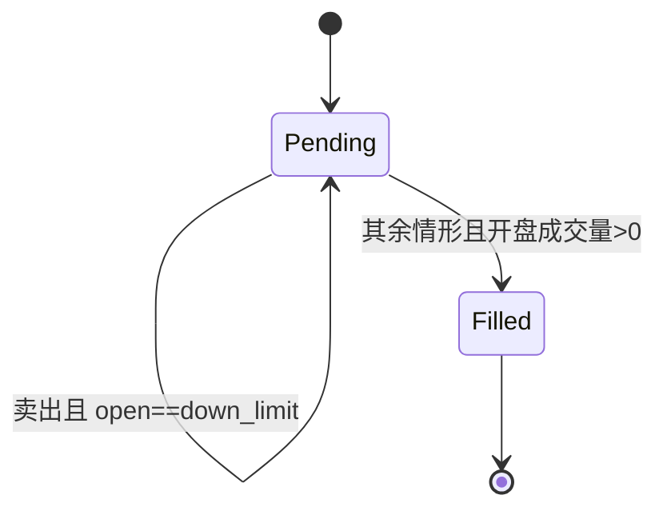

# 04｜技术设计

## 1. 总体架构



边界固定为：数据适配、研究逻辑、Notebook、内容渲染和验证分层。公开产物不依赖 Token；Notebook 不复制主管线逻辑；教学夹具不能流入真实研究结果。

## 2. 环境与统一入口

实现已按以下顺序执行；版本以最终研究护照和锁文件为准：

1. 用户级安装 uv。
2. 由 uv 安装固定 CPython 3.12 并创建锁定环境，不使用 WSL 系统 Python 3.14.4。
3. 安装 Quarto 与 Python 构建、研究、测试依赖。
4. 仅在 PDF 确有价值时安装浏览器或 TinyTeX；优先用户级，sudo 仅在必要时使用。
5. 将 uv、Python、Quarto、操作系统、包锁和可选 PDF 工具版本写入研究护照。

统一入口预定为：

```text
bash scripts/project.sh setup
bash scripts/project.sh test
bash scripts/project.sh build
bash scripts/project.sh preview
```

`setup` 负责环境和能力诊断，`test` 运行安全子集与研究测试，`build` 生成 Notebook/HTML/审计产物，`preview` 本地预览。脚本必须快速失败、输出修复建议且不回显 Token。

## 3. 预定仓库结构

```text
.
├── README.md
├── REQUIREMENTS.md
├── AI_PROMPTS.md
├── docs/
├── content/                 # Quarto 页面
├── notebooks/               # 可执行教学入口
├── src/                     # 数据契约、因子、组合、评价
├── tests/                   # 单元/契约/泄漏/回归/E2E
├── fixtures/                # 可公开确定性教学数据
├── templates/               # 问题、协议、REG、护照
├── scripts/project.sh       # 唯一项目命令入口
├── .github/workflows/       # 无 Token CI 与 Pages
├── .gitignore
├── .env.example             # 仅变量名和说明，不含值
└── _site/                   # 构建产物，按发布策略处理
```

这些路径既是实施合同，也是当前仓库的交付结构。

## 4. Tushare 数据能力矩阵

“预期权限”依据当前约 2120 积分，仅是探测假设。官方更新时间用于推导 `usable_from`；历史真实发布时间无法证明时必须披露。请求量是 2018—2025 首次完整构建的保守估算，最终以探测后的最省调用模式重算。

| 端点 | 最小字段 | 预期权限 / 官方更新 | 优先级 | 调用模式与估计请求 | 缓存键 | 研究用途 | 唯一回退 |
|---|---|---|---|---|---|---|---|
| `trade_cal` | exchange, cal_date, is_open, pretrade_date | 2000 分；官方未给精确时刻 | P0 | 全区间按交易所，约 1—2 次 | endpoint+exchange+start+end+fields | 交易日、次日开盘与延迟天数 | 从已成功 `daily` 日期并集推导，护照标注日历不完整 |
| `index_basic` | ts_code, name, fullname, market, publisher, category, base_date, list_date | 2000 分；每日约 18:00 | P0 | 按市场 2—3 次 | endpoint+market+publisher+category+fields | 发现沪深 300 价格/总收益候选实际代码 | 仅以明确候选 `000300.SH` 做最小价格指数探测；不得猜总收益代码 |
| `index_weight` | index_code, con_code, trade_date, weight | 2000 分；月度，未给精确时刻 | P0 | 按月约 96 次 | endpoint+actual_index_code+month+fields | 历史成分与当时权重 | 用当月可用 `circ_mv` 前 300 构造替代股票池，并改名，绝不称沪深 300 |
| `daily` | ts_code, trade_date, open, high, low, close, pre_close, vol, amount | 2000 分；交易日约 15:00—16:00；停牌无日线 | P0 | 先探测按日/按股；按历史成分证券区间上限约 800 次 | endpoint+ts_code/start/end+fields | 原始 OHLC、成交量、动量/波动/持有收益与开盘成交 | 受影响证券/月份不生成价格观察，触发覆盖门；不得用夹具补正式结果 |
| `adj_factor` | ts_code, trade_date, adj_factor | 2000 分；交易日前约 09:15—09:20 | P0 | 与证券区间批量，上限约 800 次 | endpoint+ts_code/start/end+fields | 相邻复权因子比计算收益 | 受影响收益标记不可用并触发覆盖门，不以未复权收益替代 |
| `daily_basic` | ts_code, trade_date, close, pb, circ_mv, limit_status | 2000 分；交易日约 15:00—17:00 | P0 | 月末截面为主，约 96—192 次 | endpoint+trade_date+fields | PB 价值、替代股票池市值、收盘状态辅助诊断 | PB 仅可沿用最近 5 个交易日内的已成功快照；超期即缺失并触发覆盖门 |
| `stk_limit` | trade_date, ts_code, pre_close, up_limit, down_limit | 2000 分；交易日约 09:00 | P0 | 探测按日/按股；证券区间上限约 800 次 | endpoint+ts_code/start/end+fields | 官方日涨跌停价与开盘成交限制 | 当日缺少限制数据的待处理订单一律延迟，不推断可成交 |
| `suspend_d` | ts_code, trade_date, suspend_timing, suspend_type | 探测确认；更新不定期 | P0 | 按证券区间批量，估计不超过 16—800 次，探测后固定 | endpoint+ts_code/start/end+fields | 官方停复牌证据 | 缺日线只能作为辅助信号：无有效日线则保守不成交；有日线则按其他规则成交并披露无正式停牌记录 |
| `index_daily` | ts_code, trade_date, open, high, low, close, pre_close, vol, amount | 2000 分；交易日约 15:00—17:00 | P0 | 每个成功候选最小窗口 1 次，完整区间约 1—2 次 | endpoint+actual_ts_code+start+end+fields | 沪深 300 对齐基准 | 使用 `index_basic` 返回且探测成功的沪深 300价格指数；明确不含股息 |

`daily_basic.limit_status` 表示收盘状态，只作诊断，不能判断下一交易日开盘是否可成交；开盘限制来自 `stk_limit`，正式停牌证据来自 `suspend_d`。缺失 `daily` 不是官方停牌认定，只能触发保守不成交和数据限制披露。

### 4.1 可用时点规则

| 数据 | 默认 `usable_from` | 说明 |
|---|---|---|
| `daily` | trade_date 16:30 Asia/Shanghai | 晚于官方 15:00—16:00 窗口 |
| `daily_basic` | trade_date 17:30 | 晚于官方 15:00—17:00 窗口 |
| `adj_factor` | trade_date 09:30 | 用于该日之后的相邻收益计算 |
| `stk_limit` | trade_date 09:15 | 仅用于执行观察，不进入此前信号 |
| `index_daily` | trade_date 17:30 | 与组合评价对齐 |
| `index_basic` | ingested date 18:30 | 代码发现元数据 |
| `trade_cal` | ingested_at | 非预测特征 |
| `index_weight` | 下一交易日 18:00，另做滞后一月敏感性 | 官方无精确历史发布时刻，必须披露 |
| `suspend_d` | ingested_at | 仅用于执行/诊断，不进入历史信号 |

## 5. 能力探测协议

主流程前逐一探测九个端点，不能用账户积分推定实际权限：

1. 选择最小日期窗、最少字段和已知候选。
2. 记录请求端点、参数、请求字段、响应字段、行数、最早/最晚日期、API 状态和实际错误代码。
3. 记录是否有权限、实际返回代码、历史覆盖、空返回与权限错误的区别。
4. 评估其是否满足研究用途、`usable_from` 规则和唯一回退条件。
5. 只有成功能力进入主请求估算；失败能力启用矩阵中的唯一回退或停止相关研究。

基准探测顺序固定：



不得直接用裸 `H00300` 调 API。H00300 只是候选语义，实际完整代码必须来自 `index_basic` 且探测成功。

## 6. 请求治理、缓存与清单

- 全局令牌桶默认不超过 180 次/分钟，为账户 200 次/分钟上限留余量。
- 能按交易日批量就不逐证券调用；探测后重新估算端点请求数和总量。
- 对超时与 429 使用带抖动的指数退避；权限/参数错误不盲目重试。
- 每个任务保存游标与完成分片，可安全续跑。
- 成功响应按内容寻址写入不可变缓存；相同快照键若返回不同内容，保留两份并触发冲突门，绝不覆盖。
- 原始缓存默认仓库外，公开构建只消费经许可的派生产物或教学夹具。

每个数据清单条目至少含：endpoint、规范化参数、请求/响应字段、行数、日期范围、内容哈希、抓取时间、状态、错误代码、实际证券/指数代码、缓存对象、许可分类。清单不得包含 Token、请求头或可恢复密钥的信息。

## 7. 时间、标签与收益契约



字段定义：

- `trade_date`：行情归属交易日。
- `effective_date`：成分或规则生效日期。
- `ingested_at`：本项目实际抓取时间。
- `usable_from`：依据官方更新和保守缓冲推导的最早可用时点。
- `signal_at`：所有输入均可用后形成信号的时点，默认月末 18:00。
- `execution_at`：实际成交开盘时点。

核心断言为 `usable_from <= signal_at < execution_at`。信号不能宣称在收盘瞬间完成。历史发布日期无法验证时在数据护照标黄，并运行保守滞后敏感性。

原始 OHLC 只来自 `daily`，收益固定为：

```text
r_t = (price_t * adj_factor_t) / (price_{t-1} * adj_factor_{t-1}) - 1
```

标签向后移；不得用未来最终因子归一化绝对价格。组合日收益按上一时点实际持仓计算；未成交订单继续承受旧持仓收益，延迟订单只在实际成交时产生换手与成本。基准使用相同可实现区间。

## 8. 成交状态机



卖出涨停或买入跌停不自动判为未成交。未成交保留持仓，并在后续有效日优先重试。模型不表示盘口排队、深度或部分成交；输出延迟次数、延迟交易日数、受影响权重、实际换手和实际成本。

## 9. 确认期与研究护照

首次确认揭示前，冻结假设、因子、参数、数据版本、成交/成本、评价规则和 REG。只允许一次影响研究判断的揭示；同输入确定性复现不增加研究决策计数，工程修复重跑另记。参数修改后的确认结果标记污染并降级探索性，日志不可删除恢复。

护照至少记录环境版本、提交哈希、依赖锁哈希、数据清单哈希、端点能力/错误、实际代码、历史范围、基准来源与股息标识、参数、REG、构建产物，以及：

`confirmation_reveal_count`、`research_decision_count`、`reproduction_run_count`、`contaminated`、`contamination_reason`。

## 10. Token 与公开发布安全

Token 注入只允许二选一：

1. WSL 环境变量 `TUSHARE_TOKEN`。
2. 固定仓库外文件 `~/.config/shangchen-quant-research-onboarding/tushare.env`，权限必须为 600。

项目只读。实施第一天创建 `.gitignore`；`.env.example` 只能写变量名与安全说明，不能含值。Token 不得进入 Notebook 输入/输出、异常堆栈、日志、测试快照、HTML、PDF、数据清单、研究护照、截图、README 或 `AI_PROMPTS.md`。CI 不注入 Token，只运行教学夹具与静态安全检查。

公开审计范围必须覆盖：

- 已跟踪和未跟踪文件、完整 Git 历史。
- Notebook 输入/输出、`_site`、PDF、测试快照、日志、清单、错误信息。
- README、`AI_PROMPTS.md`、`.env*`、配置文件。
- 高熵字符串、常见 Token/API key/私钥前缀、本机用户名和私有绝对路径。
- Tushare 原始/授权数据、缓存和可大规模重构的数据片段。

允许公开：源码、原创课程、原创图表、聚合指标、确定性夹具、不可逆哈希、字段说明和复现方法。默认禁止：Token、Cookie、私钥、真实 `.env`、原始 Tushare 数据/缓存或大规模重构材料、含秘密的历史、许可未确认的再分发数据。派生结果逐项评估；许可不清晰时，公开可执行结果使用夹具，真实结果只发布不可逆聚合和方法。

若密钥进入 Git 历史：立即停止推送/Pages，轮换 Token，清理所有历史与构建缓存，重新做全范围扫描，确认远端和产物无残留后才能恢复发布。

## 11. 测试与质量门

| 层级 | 必测内容 |
|---|---|
| 单元 | 相邻复权收益、因子方向、标准化、权重、成本、延迟成交 |
| 契约 | 九端点字段、类型、唯一键、日期、实际代码与空/权限错误 |
| 时点/泄漏 | `usable_from` 断言、标签移位、信号/执行顺序、未来因子禁用 |
| 数据质量 | 覆盖率、重复、异常价、权重和、成分有效期、基准区间 |
| 回归 | 固定夹具的指标、失败实验方向和 REG 结果 |
| E2E | Notebook 从头执行、Quarto 离线构建、统一命令、无 Token 路线 |
| 内容 | 20 步、三路线、链接、图片替代文本、README 冷启动与视觉检查 |
| 安全 | 密钥/路径/历史/Notebook/站点/原始数据扫描 |

## 12. 构建、发布与冻结

Pages 和离线 HTML 从同一冻结输入构建；公开 CI 使用 CPython 3.12 锁定环境且不需要 Token。发布顺序为：测试 → Notebook E2E → 内容构建 → 链接/视觉 → 安全许可审计 → Pages → 外部 URL 验证 → 研究护照封存。

冻结键由提交哈希、依赖锁哈希、数据清单哈希、配置哈希和构建工具版本组成。相同冻结键的重复运行属于复现；任何影响研究结论的键变化都必须新建实验记录。
